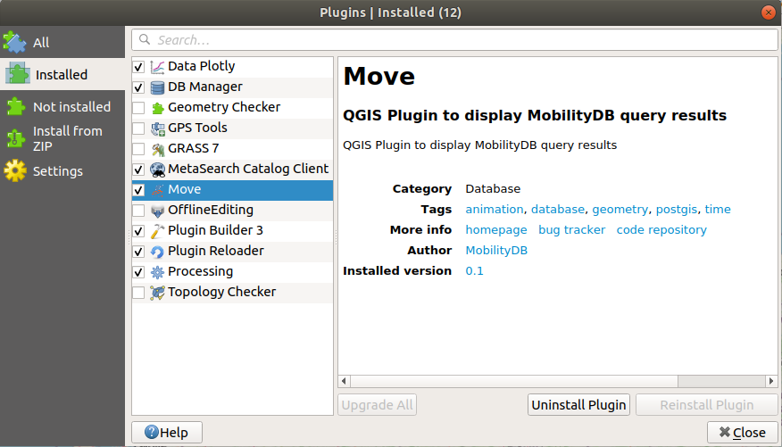
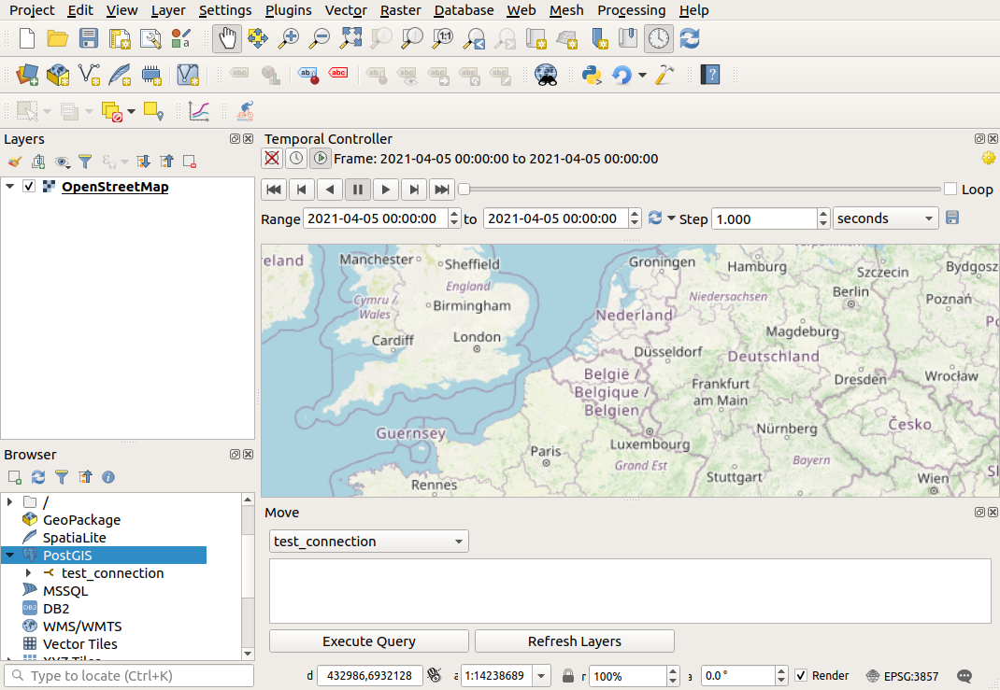

# <p align=center><ins>MOVE</ins><br/>Interactive Visual Exploration of Moving Objects

QGIS Plugin to display MobilityDB query results

This plugin allows users to query [MobilityDB](https://github.com/MobilityDB/MobilityDB) databases using SELECT statements, and display the resulting spatial and spatio-temporal columns as QGIS layers.

## Prerequisites

 - [QGIS](https://www.qgis.org/en/site/) 3.40 or later
 - [MobilityDB](https://github.com/MobilityDB/MobilityDB)

## Installation steps

Installing the plugin is done locally using the [Plugin Builder Tool](http://g-sherman.github.io/plugin_build_tool/).

 1. Clone the [Move github repository](https://github.com/mschoema/move) (or download and unzip the project) in the directory of your choice.
 2. Install the [Plugin Builder Tool](http://g-sherman.github.io/plugin_build_tool/).
 3. Open a terminal in the [move](https://github.com/mschoema/move/tree/master/move) directory and run the following command:
```shell
pbt deploy -y
```
 4. In QGIS, go to Plugins->Manage and Install Plugins->Installed, and check the box next to the plugin.



## Using the plugin

### Plugin interface

The plugin has a simple interface that can be opened using Database->Move->Open Move Interface, or using the button in the top toolbar.

When opened, the plugin is displayed as a widget at the bottom of the QGIS window, and it has 4 elements:

 1. A combobox to select the database to use.
 2. A textbox to write SQL SELECT queries.
 3. An *Execute Query* button.
 4. A *Refresh Layer* button.



### Database connection

The plugin detects existing PostGIS database connections, and lists them in its combobox.  
When executing a query, the plugin will use the database connection currently selected in the combobox.  
To refresh the available databases, simply close and re-open the plugin.

#### Database requirements

To work correctly, the plugin requires these database connections to have their username and password stored.  
The plugin stores the layers of a query as materialized views in the database, named after an identifier of the QGIS project that the project file keeps.  
Several projects, of one or several users, can therefore work on the same database, and the views of a saved project are found again when it is reopened.  
Executing a query drops the views of the project that no layer of the project uses any more.  
The views are created in the current schema of the connection, the first existing schema of its search path, on which the user needs the CREATE privilege.  
The tables of the query can be in any schema.

### Execute Query

To use the plugin, simply write a SELECT query in the textbox and press the *Execute Query* button to execute it.  
The plugin will create layers for each spatial or spatio-temporal column returned by the query.  

Since some queries can be long to execute, all queries are run in the background.  
Checking if a query is still being run can be done by looking at the running tasks at the bottom of the QGIS window.  
When the query execution is completed, the plugin will create the appropriate layers in QGIS.  
This last step might freeze the QGIS window for a moment, but this should only take a few seconds.

**BE CAREFUL: Writing queries that return millions of lines might crash QGIS.**  
Use a LIMIT at the end of the query to restrict the amount of features created.

The message bar at the top of the map states the outcome of each query: the layers it created with their number of features, or why it created none, such as an error of the query, a query returning no rows, or a query returning no column the plugin displays.


#### PostGIS geometries

PostGIS geometry columns create up to three layers depending on the geometry types present in the column:

 - *MultiPoint* layer if there are *Point* or *MultiPoint* geometries in the column
 - *MultiLineString* layer if there are *LineString* or *MultiLineString* geometries in the column
 - *MultiPolygon* layer if there are *Polygon* or *MultiPolygon* geometries in the column

#### MobilityDB temporal points

MobilityDB *tgeompoint*, *tgeogpoint*, *tnpoint* or *tcbuffer* columns will result in a QGIS layer each.  
These layers are marked as temporal, and can be explored using the temporal controller in QGIS. (View->Panels->Temporal Controller Panel)  
For a fluid animation, set the step to a small interval and the frame rate to 60.

Each layer holds one feature per chunk of at most 32 segments of a sequence of the temporal points, one per segment of a sequence with step interpolation, and one per instant, and draws each point at its position at the end of the current frame of the temporal controller.
The position is interpolated linearly between the two instants of the chunk around the frame, so a *tgeogpoint* moves along the straight line in longitude and latitude between two instants rather than along the great circle.
An instant, or a sequence reduced to one instant, is drawn while the frame contains it.
A *tnpoint* is drawn through its conversion to a *tgeompoint*, which follows its route.
A *tcbuffer* is drawn as the circle around its center, its center and radius interpolated linearly between the two instants around the frame.

#### MobilityDB temporal geometries

MobilityDB *tgeometry* or *tgeography* columns create up to three temporal layers, one per type of geometry the values take, like PostGIS geometry columns: *MultiPoint*, *MultiLineString* and *MultiPolygon*.
Each layer holds one feature per segment of the temporal geometries, carrying the value of the segment from its start to its end, and the temporal controller shows each value in every frame that overlaps the time the value holds.

### Refresh Layer

The layers are related to the query that created them, but they are not updated automatically when the initial tables used in the query are updated. The *Refresh Layer* button refreshes the layer selected in the layers panel by re-executing the query that created it, and redraws the layers created from the same query column.

## Issues and ideas

For any issues or improvement ideas, open a new git issue or send an email to maxime.schoemans@ulb.be

## License

Move is licensed under the terms of the GPL-2.0 License (see the file
[LICENSE](https://github.com/mschoema/move/blob/master/LICENSE)).
